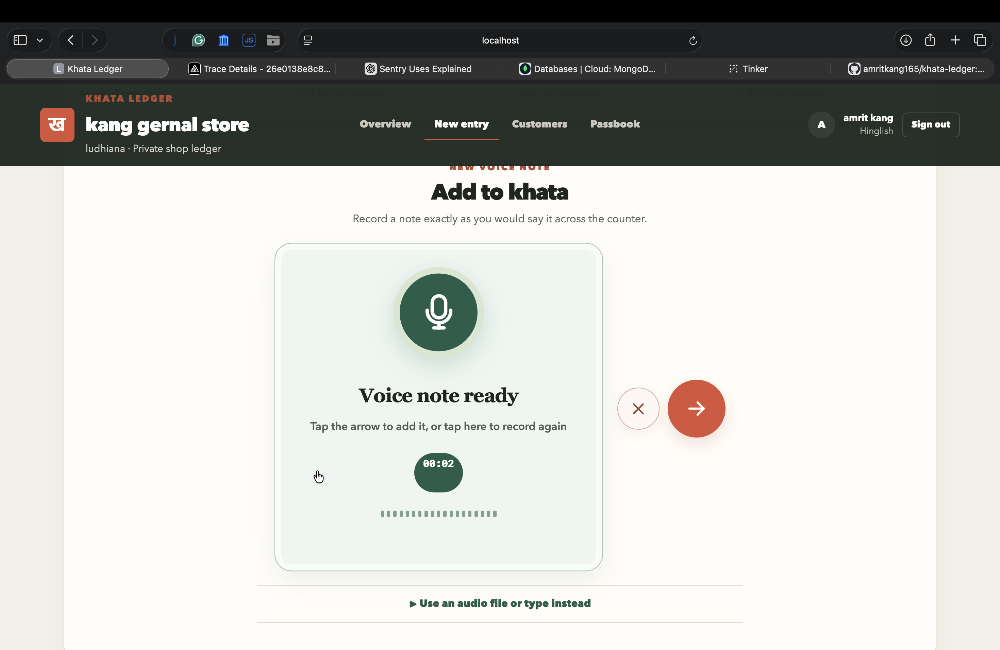
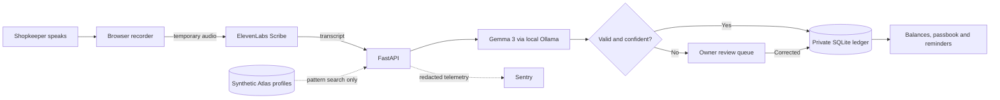
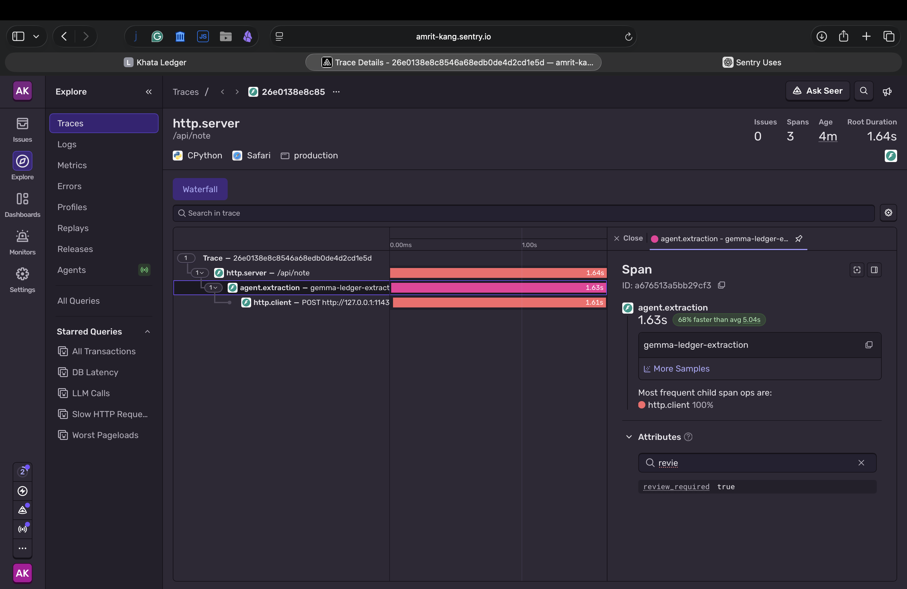
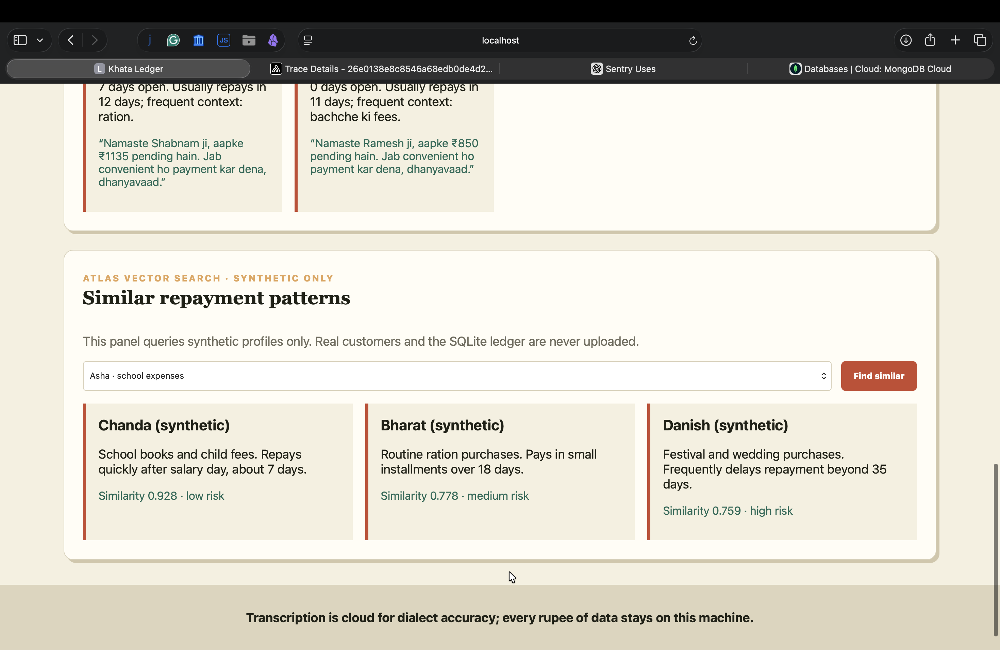
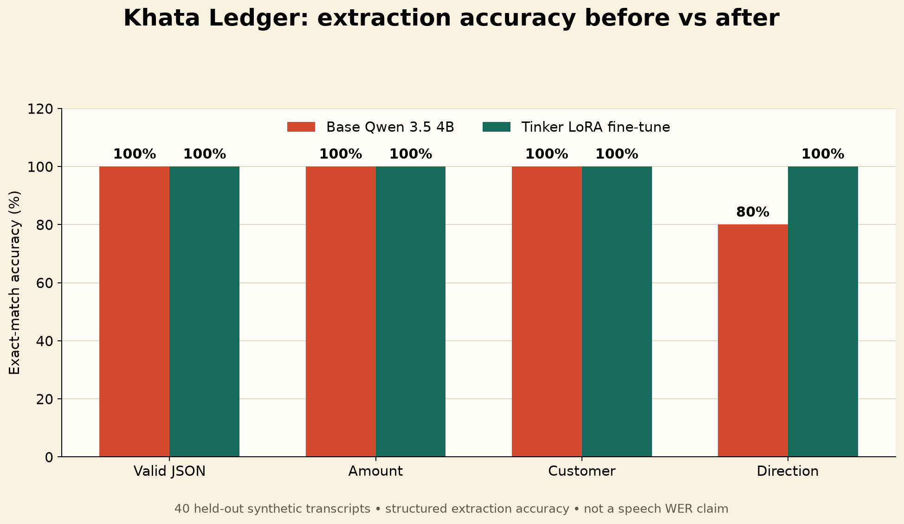

# Khata Ledger

### Bol ke likho. Hisaab simple rakho.

Khata Ledger is a voice-first credit ledger for kirana stores and other small shops. A shopkeeper can speak a natural note such as:

> “Ramesh bhai ko 850 rupaye ka ration diya, Friday tak dega.”

The app transcribes the audio, extracts the customer, amount, transaction type and due date, then safely adds the entry to that shopkeeper's private ledger.



## Why this exists

Many neighbourhood shopkeepers still manage credit in notebooks, memory, or scattered chat messages. Traditional accounting products often expect careful typing, formal bookkeeping language, and constant connectivity.

Khata Ledger is designed around the way a shopkeeper already works:

- speak naturally in Hindi, Hinglish, Punjabi-accented English, or everyday shop language;
- review uncertain entries instead of silently saving bad financial data;
- keep customer balances separated by shop account;
- see exactly who owes money and when a reminder is actually due;
- retain the real financial ledger in a local SQLite database.

## Product highlights

| Capability | What it does |
| --- | --- |
| Voice-first entry | Records directly from the browser with a live, real-volume waveform and recording timer. |
| Dialect-aware transcription | Uses ElevenLabs Scribe v2 for speech-to-text. Uploaded audio is processed temporarily and is not saved by this application. |
| Local AI extraction | Gemma 3 runs through Ollama and converts the transcript into validated ledger fields. |
| Safe review gate | Missing amounts and extraction confidence below `0.6` are sent to a correction queue, never directly to the ledger. |
| Duplicate protection | Idempotency keys prevent repeated taps or retried requests from creating duplicate transactions. |
| Private shop accounts | Local authentication, expiring server sessions, and owner-scoped queries isolate each shop's records. |
| Useful reminders | Customers appear for follow-up only when the due date arrives or credit has remained open for several days. |
| Complete message context | Reminder messages include the current balance and dated account history, ready to copy or share. |
| Searchable passbook | Search transactions by customer, filter credit versus payments, and remove incorrect entries. |
| Observable AI pipeline | Optional Sentry spans show request and model latency while financial output stays redacted by default. |
| Privacy-safe retrieval | MongoDB Atlas Vector Search operates only on explicitly synthetic repayment profiles. |

## How it works



### Privacy boundary

| Data | Location |
| --- | --- |
| Uploaded voice note | Sent to ElevenLabs for transcription; not persisted by Khata Ledger |
| Transcript during extraction | Sent to the shopkeeper's local Ollama server |
| Accounts, customers and rupee-level records | Local SQLite database configured by `KHATA_DB_PATH` |
| Passwords | Salted PBKDF2-SHA256 hashes; plaintext passwords are never stored |
| Browser session | Random server-side session with an `HttpOnly`, `SameSite=Strict` cookie |
| Sentry telemetry | Optional; parsed financial output is redacted unless synthetic tracing is explicitly enabled |
| MongoDB Atlas | Synthetic profiles only—never real customers or ledger rows |

## Quick start

### Requirements

- macOS, Linux, or Windows
- Python 3.11 or newer
- [uv](https://docs.astral.sh/uv/)
- [Ollama](https://ollama.com/)
- an ElevenLabs API key for real voice transcription

Gemma 3 4B requires an approximately 3.3 GB model download. Keep additional free disk space available for the Python environment and runtime files.

### 1. Install dependencies

```bash
git clone https://github.com/amritkang165/khata-ledger.git
cd khata-ledger
uv sync --extra dev
```

### 2. Configure the application

```bash
cp .env.example .env
```

Add your ElevenLabs key to `.env`:

```dotenv
ELEVENLABS_API_KEY=your_key_here
```

Do not commit `.env`; it is intentionally ignored by Git.

### 3. Start Ollama and download Gemma

On macOS, open the Ollama application:

```bash
open -a Ollama
ollama pull gemma3:4b
```

On other systems, start the server directly if it is not already running:

```bash
ollama serve
```

Verify the model in another terminal:

```bash
ollama run gemma3:4b "Reply with only: KHATA READY"
```

### 4. Run Khata Ledger

```bash
./start.sh
```

Open [http://localhost:8000](http://localhost:8000), create a shop account, allow microphone access, and record the first entry.

If ElevenLabs is not configured, open **Use an audio file or type instead** and use the manual transcript box to test extraction, review gating, matching, storage, and reminders.

## Example notes

```text
Ramesh bhai ko 850 rupaye ka ration diya, Friday tak dega
Sunita owes 420 rupees for school books, payment by Monday
Vanshika ne 500 rupaye wapas de diye
Deepak ko aaj 333 rupaye ka school samaan diya
```

Credit given increases the customer's outstanding balance. Payment received reduces it.

## Screenshots and evidence

### Voice-first shop interface

The main experience keeps the microphone central, gives immediate recording feedback, and places discard and submit controls beside the note.


### Sentry tracing

FastAPI requests, local model extraction, and downstream HTTP work appear as connected spans. Financial output remains redacted by default.



### MongoDB Atlas Vector Search

Atlas retrieves similar repayment patterns from a synthetic-only dataset. Real customer records never leave SQLite for this feature.



### Tinker evaluation

The measured synthetic extraction evaluation improved transaction-direction accuracy from 80% to 100% on a fixed 40-example held-out split.



This result measures transcript-to-ledger extraction, not speech-recognition word error rate.

## Configuration

| Variable | Default | Purpose |
| --- | --- | --- |
| `ELEVENLABS_API_KEY` | empty | Enables real audio transcription |
| `ELEVENLABS_MODEL_ID` | `scribe_v2` | ElevenLabs transcription model |
| `OLLAMA_URL` | `http://127.0.0.1:11434` | Local Ollama server |
| `OLLAMA_MODEL` | `gemma3:4b` | Local extraction model |
| `OLLAMA_ENABLED` | `true` | Disables local-model calls when set to `false` |
| `KHATA_DB_PATH` | `data/khata.db` | SQLite ledger location |
| `SESSION_COOKIE_SECURE` | `false` | Set to `true` behind production HTTPS |
| `SENTRY_DSN` | empty | Enables optional Sentry monitoring |
| `ALLOW_SYNTHETIC_TRACE_DATA` | `false` | Allows richer traces only for synthetic demonstrations |
| `MONGODB_URI` | empty | Enables synthetic Atlas pattern retrieval |
| `ATLAS_DATABASE` | `khata_patterns` | Atlas database name |
| `ATLAS_COLLECTION` | `synthetic_customer_patterns` | Atlas synthetic collection |
| `ATLAS_VECTOR_INDEX` | `pattern_vector_index` | Atlas vector index |

## API overview

All ledger endpoints are scoped to the authenticated shop owner.

| Method | Endpoint | Purpose |
| --- | --- | --- |
| `POST` | `/api/auth/register` | Create a shop account |
| `POST` | `/api/auth/login` | Start an authenticated session |
| `POST` | `/api/auth/logout` | End the current session |
| `GET` | `/api/auth/me` | Return the signed-in account |
| `POST` | `/api/note` | Process audio or a manual transcript; accepts `Idempotency-Key` |
| `GET` | `/api/ledger` | Return current customer balances |
| `GET` | `/api/transactions` | Return the owner-scoped passbook |
| `DELETE` | `/api/transactions/{id}` | Remove an incorrect transaction |
| `GET` | `/api/reviews` | Return uncertain notes awaiting correction |
| `POST` | `/api/reviews/{id}/approve` | Save a corrected review |
| `DELETE` | `/api/reviews/{id}` | Discard a review |
| `GET` | `/api/brief` | Return due reminders and repayment context |
| `GET` | `/api/health` | Report service and model configuration |

Interactive OpenAPI documentation is available at [http://localhost:8000/docs](http://localhost:8000/docs) while the server is running.

## Project structure

```text
app/
├── brief/          reminder eligibility and repayment summaries
├── db/             SQLite ledger and synthetic Atlas integration
├── pipeline/       transcription, extraction and customer matching
├── ui/             responsive HTML, CSS and JavaScript interface
├── auth.py         password hashing and session security
├── main.py         FastAPI routes and orchestration
└── schemas.py      validated API and extraction models

scripts/
├── finetune/       Tinker dataset, training and evaluation scripts
└── seed/           reproducible synthetic data and Atlas verification

tests/              API, extraction, matching, brief and Atlas tests
results/            evaluation charts and integration evidence
```

## Tests

```bash
uv run pytest -q
```

The test suite covers authentication isolation, the ledger API, extraction, customer matching, review gating, reminders, Atlas behavior, and fine-tuning data preparation.

## Synthetic Atlas demo

Real ledger rows must never be uploaded to Atlas. To seed and verify the isolated synthetic dataset:

```bash
.venv/bin/python -m scripts.seed.seed_atlas
.venv/bin/python -m scripts.seed.verify_atlas
```

Expected verification ends with:

```text
Verified synthetic-only Atlas Vector Search
```

## Tinker experiment

The live Tinker catalog used during development did not expose a Whisper/audio fine-tuning path, so the experiment targets transcript-to-ledger JSON extraction instead.

```bash
uv sync --extra experiment
python scripts/seed/generate_transcripts.py
python scripts/finetune/prepare_data.py
```

The reproducible dataset contains 200 synthetic notes: 160 training examples and a fixed 40-example test split. Metrics and predictions are stored under `results/`.

## Docker and Render

Run the application with Docker Compose:

```bash
docker compose up --build
```

Ollama remains on the host machine. `render.yaml` defines a Docker web service with a persistent disk mounted at `/var/data`; secrets must be entered through the Render dashboard.

The hosted configuration uses `OLLAMA_ENABLED=false` because Render cannot access the shopkeeper's local Ollama process. Use only synthetic notes on a public demonstration deployment. The full local Gemma flow is the intended privacy-preserving configuration.

## Security notes

- Never commit `.env`, API keys, `data/khata.db`, or real voice recordings.
- Use `SESSION_COOKIE_SECURE=true` when serving behind HTTPS.
- Back up the SQLite database if the ledger becomes operationally important.
- Keep Atlas limited to synthetic data unless the privacy architecture is intentionally redesigned.
- This project is an early product build, not audited financial software.

## Current limitations

- Speech word-error rate has not yet been measured on a consented real-world dialect dataset.
- Due phrases support ISO dates, today/tomorrow, and weekday wording; richer natural-language calendar parsing is still limited.
- The local-first deployment currently assumes one running application instance sharing its configured SQLite file.
- Public deployment requires careful secrets, HTTPS, persistent storage, backups, and operational monitoring.

## License and authorship

Built by **Amrit Kang**.

Copyright © 2026 Amrit Kang. All rights reserved.
